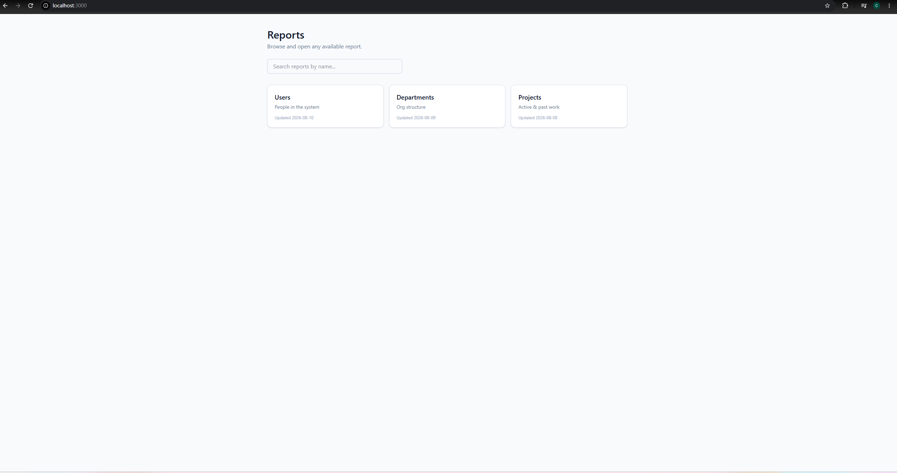
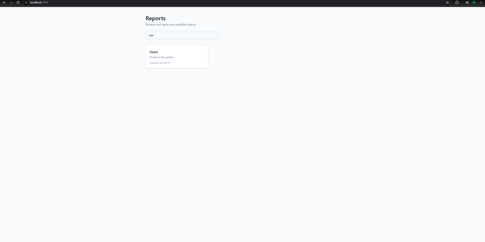
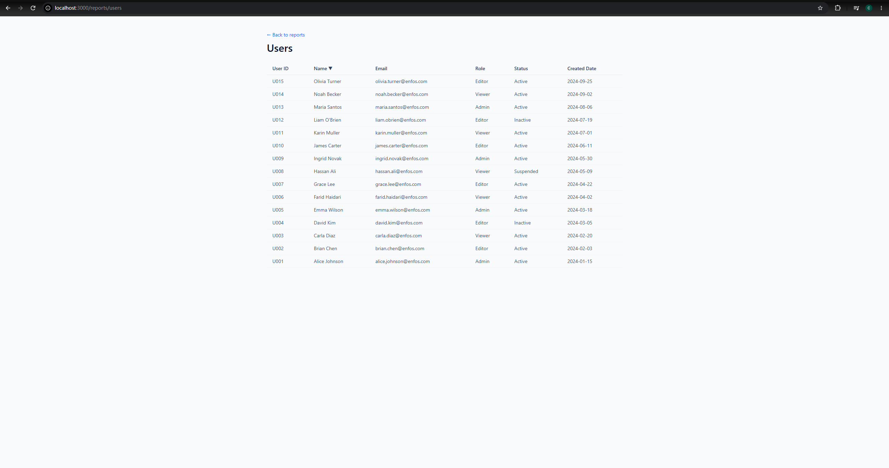
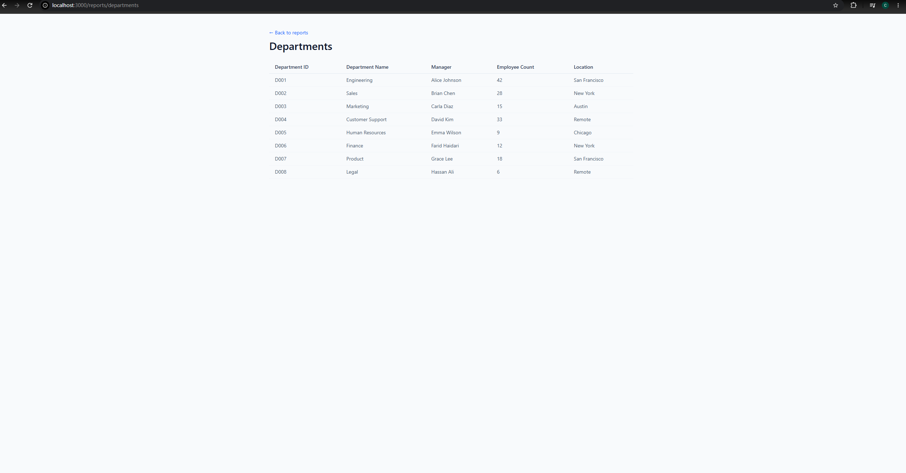
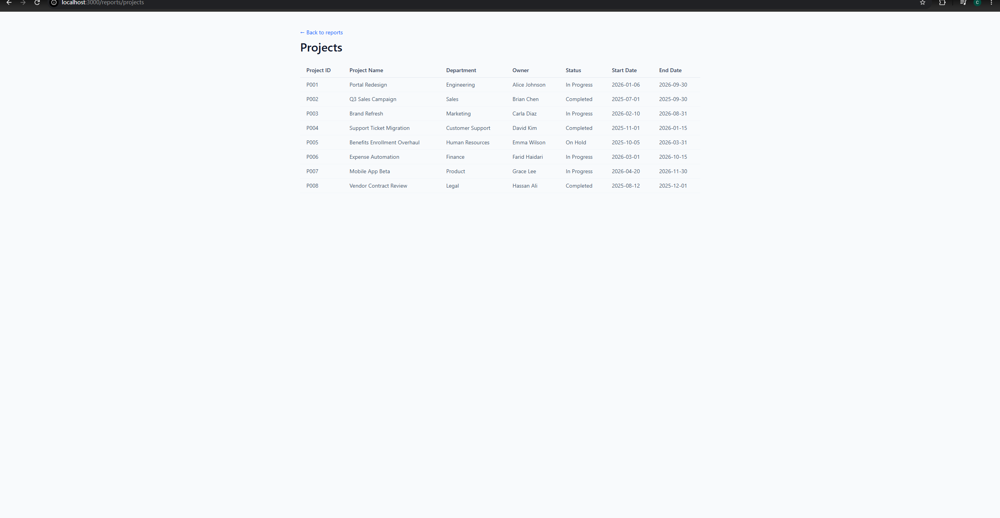
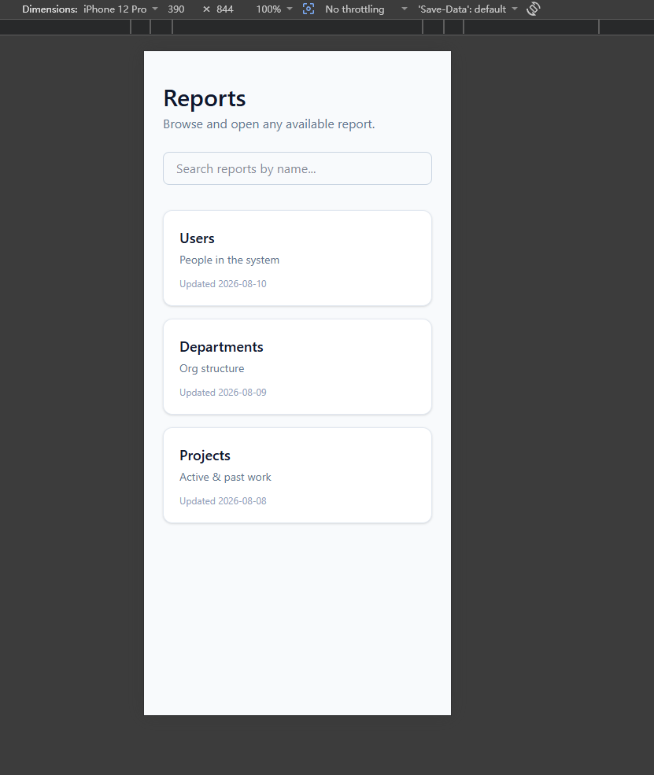
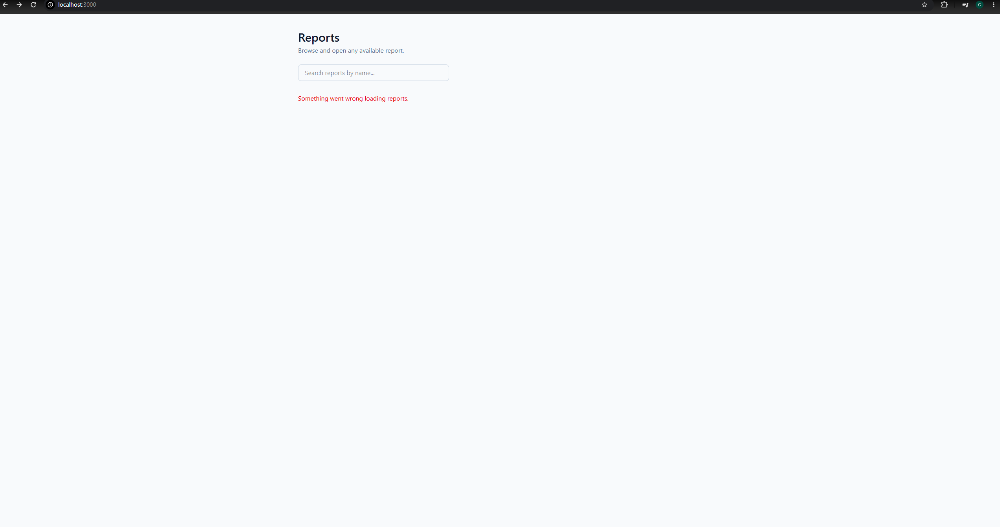

# Reporting Portal

An internal reporting portal where users browse a fixed set of available reports (Users, Departments, Projects) and explore each one's data in a table. See [`CONTEXT.md`](CONTEXT.md) for domain terminology.

## Prerequisites

| Tool | Version | Needed for |
|---|---|---|
| Docker + Docker Compose | any recent version | the one-command path |
| Java (JDK) | 21 | running the backend outside Docker |
| Node.js | 22+ | running the frontend outside Docker |

You only need Docker **or** Java+Node, depending on which path below you use.

## Run it: one command (Docker)

```bash
docker compose up --build
```

- Frontend: [http://localhost:3000](http://localhost:3000)
- Backend API: [http://localhost:8080/api](http://localhost:8080/api)

The frontend container serves the built static app via nginx, which proxies any `/api/*` request to the backend container (see `frontend/nginx.conf`) — the browser only ever talks to `localhost:3000`, so there's no CORS configuration to maintain.

## Run it: local dev (no Docker)

From the repo root:

```bash
npm run dev
```

This runs `scripts/dev.mjs`, which starts the Spring Boot backend (`./mvnw spring-boot:run`) and the Vite dev server (`npm run dev` in `frontend/`) together, and shuts both down on Ctrl-C.

- Frontend (Vite, with hot reload): [http://localhost:5173](http://localhost:5173) — Vite's dev server proxies `/api` to `http://localhost:8080` (see `frontend/vite.config.ts`)
- Backend API: [http://localhost:8080/api](http://localhost:8080/api)

To run either half on its own:

```bash
# backend only
cd backend && ./mvnw spring-boot:run

# frontend only (requires the backend running separately for data to load)
cd frontend && npm install && npm run dev
```

### Tests

```bash
# backend
cd backend && ./mvnw test

# frontend
cd frontend && npm test
```

## Screenshots / demo video

**Landing page**


**Search / filter**


**Users report** (sorted by Name)


**Departments report**


**Projects report**


**Responsive layout** (mobile viewport)


**Error state** (backend unreachable)


_Demo video: placeholder — link goes here once recorded._

## Assumptions and Tradeoffs

**Docker Compose for one-command startup.** Docker Compose provides a standardized and inspectable way to build and run the frontend and backend together with one command. The trade-off is that Docker must be installed, so the project also includes an `npm run dev` workflow for local development without Docker.

**A registry-based report API instead of separate controllers.** `ReportRowController` and `ReportRegistry` serve report data through `GET /api/reports/{reportId}`, including the required `/users`, `/departments`, and `/projects` routes. This avoids duplicating controller logic and makes adding another report primarily a registration task. The trade-off is that the registry introduces an additional abstraction that would be unnecessary for a single report.

**Frontend-defined table columns instead of a backend-driven schema.** Each report defines its columns and display order in the frontend, while the backend returns only row data. This keeps the API simple and maintains compile-time visibility of each report's presentation. The trade-off is that adding or changing a report schema may require coordinated frontend and backend changes. A metadata-driven schema could be more appropriate if reports became user-configurable.

**MSW for frontend API tests.** Mock Service Worker intercepts requests at the network boundary, allowing tests to exercise the application's real fetching, loading, empty, and error behavior without coupling tests to a mocked API module. This adds some test setup, but provides more realistic coverage than mocking `fetch` directly.

**In-memory sample data instead of a persistence layer.** The assessment does not require writes or persistence, so report data and `lastUpdated` values are static and stored in memory. This keeps the solution focused and avoids unused database, migration, and entity-mapping infrastructure. In production, I would replace this layer with persistent storage and derive update timestamps from the underlying data.
